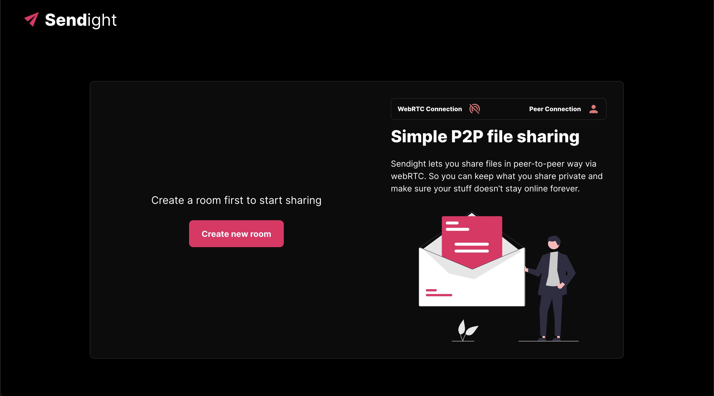
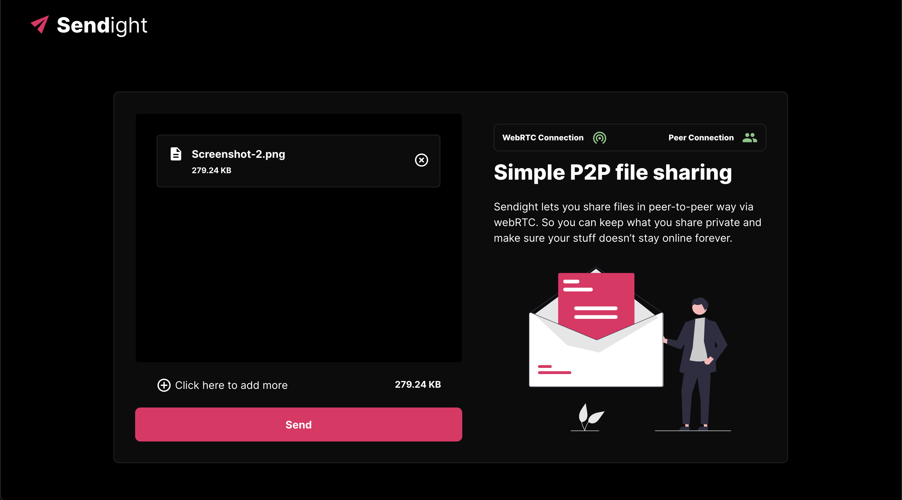
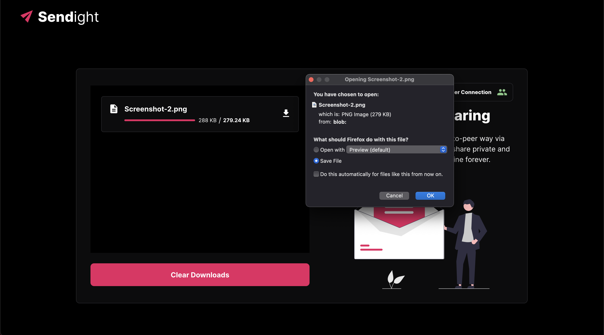

# Sendight

Sendight is a Peer-to-Peer file sharing platform built on top of webRTC. You can share files with your friend without uploading them anywhere on the server. Just share your Sendight room URL with your friend and start sharing files without the hassle of installing any app.

## How to setup sendight-frontend

- Clone the respository using `git clone https://github.com/thephilomaths/sendight-frontend.git`
- Open a terminal in the project root and install all dependencies using `yarn install`
- Serve the frontend using `yarn start`
- Open a browser and go to `http://localhost:3000`. You can now use the app

## How to use the app

- Prerequisites:
  - Serve the backend and frontend. The backend can be found [here](https://github.com/thephilomaths/sendight-backend)
  - Change `socketURL` in `src/routes.ts` to `http://localhost:8000`
- Open the frontend in a browser window by going to `http://localhost:3000`
- Click on create room
- After creating the room, you will notice that the route in the address bar changes. The new route is the URL of the room
- Copy the room URL and share it with anyone with whom you want to share a file with
- The other party can join the room by using the above URL
  - Note: Only 2 people can join the room at a time
- After both the parties have joined the room, you should be able to see the status of webRTC and peer connections change from red to green. If this doesn't happen, some error has occured while creating the webRTC connection. Try refreshing the page and if that doesn't work, then you may be behind a symmetric NAT gateway.
- Now click on `Select files to send` and select any file(s) that you want to send
- After selecting the files click `Send`
- Now, you should be able to see the statuses of files being sent and the receiver should be able to see the file being received
- You can cancel the sending process any time
- After the files are sent, the receiver will see a download button alongside each file

## Known Issues

- WebRTC connection failure
- Not able to send same file multiple times
- Slow speed while sending large files

## TODO

- [ ] Improve speed
- [ ] Use a database for storing received files instead of storing in memory
- [ ] Issue with UI on mobile devices

## Tech stack

- React.js
- Styled components
- Socket.io
- WebRTC

## Contribute

- To file any issue -> [here](https://github.com/thephilomaths/sendight-frontend/issues)
- Feel free to contribute :D

## Screenshots

- Landing page

  

- Room

  

- Select files and connection establishment

  

- Send files

  

- Receive and download files

  

### UI design inspiration from [Firefox Send](https://github.com/mozilla/send). Firefox Send was an awesome project, sad that Mozilla stopped it :(
